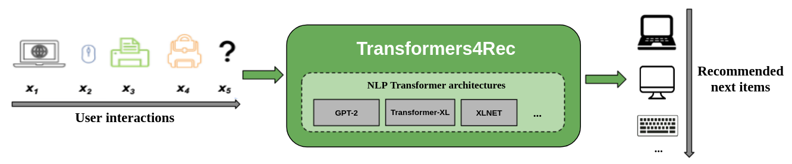
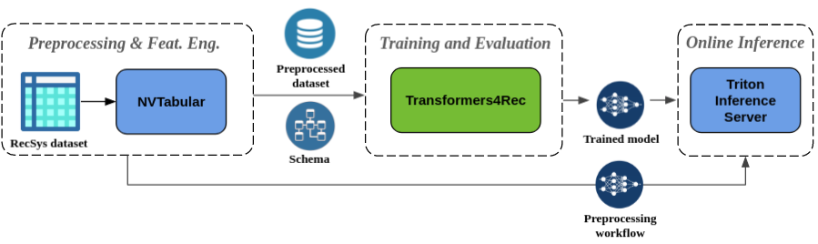

# [Transformers4Rec](https://github.com/NVIDIA-Merlin/Transformers4Rec/) | [Documentation](https://nvidia-merlin.github.io/Transformers4Rec/main/)
<p align="left">
    <a href="https://github.com/NVIDIA-Merlin/Transformers4Rec/actions/workflows/ci.yml">
        
    </a>
    <a href="https://github.com/NVIDIA-Merlin/Transformers4Rec/blob/main/LICENSE">
        
    </a>
    <a href="https://nvidia-merlin.github.io/Transformers4Rec/">
        
    </a>
    <a href="https://github.com/NVIDIA-Merlin/Transformers4Rec/releases">
        
    </a>
</p>

Transformers4Rec is a flexible and efficient library for sequential and session-based recommendation, available for both PyTorch and Tensorflow. 

It works as a bridge between NLP and recommender systems by integrating with one the most popular NLP frameworks [HuggingFace Transformers](https://github.com/huggingface/transformers), making state-of-the-art Transformer architectures available for RecSys researchers and industry practitioners. 


<div style="text-align: center; margin: 20pt"><br><figcaption style="font-style: italic;">Sequential and Session-based recommendation with Transformers4Rec</figcaption></div>

Transformers4Rec supports multiple input features and provides configurable building blocks that can be easily combined for custom architectures.


You can build a fully GPU-accelerated pipeline for sequential and session-based recommendation with Transformers4Rec and its smooth integration with other components of [NVIDIA Merlin](https://developer.nvidia.com/nvidia-merlin):  [NVTabular](https://github.com/NVIDIA/NVTabular) for preprocessing and [Triton Inference Server](https://github.com/triton-inference-server/server).

## Highlights

- **Winning and SOTA solution**: We have leveraged and evolved the Transformers4Rec library to win two recent session-based recommendation competitions: the [WSDM WebTour Workshop Challenge 2021, organized by Booking.com](https://developer.nvidia.com/blog/how-to-build-a-winning-deep-learning-powered-recommender-system-part-3/), and the [SIGIR eCommerce Workshop Data Challenge 2021, organized by Coveo](https://medium.com/nvidia-merlin/winning-the-sigir-ecommerce-challenge-on-session-based-recommendation-with-transformers-v2-793f6fac2994). Furthermore, we have also done extensive empirical evaluation on the usage of Transformers4Rec for session-based recommendation, which was able to provide higher accuracy than baselines algorithms, as published in our [ACM RecSys'21 paper](https://github.com/NVIDIA-Merlin/publications/blob/main/2021_acm_recsys_transformers4rec/recsys21_transformers4rec_paper.pdf).

- **Flexibility**: The building blocks are modularized and are compatible with vanilla PyTorch modules and TF Keras layers. You can create custom architectures, e.g. with multiple towers, multiple heads/tasks and losses.

- **Production-ready**: Exports trained models to serve with Triton Inference Server in a single pipeline that includes online features preprocessing and model inference.

- **Leverages cutting-edge NLP research**: With the integration with [HuggingFace Transformers](https://github.com/huggingface/transformers), you have available more than 64 different Transformer architectures (and counting) to evaluate for your sequential and session-based recommendation task.

- **Support for multiple input features**: HF Transformers supports only sequence of token id as input, as it was originally designed for NLP. Due to the rich features available in RecSys datasets, transformers4Rec enables the usage of HF Transformers with any type of sequential tabular data. The library uses a schema format to configure the input features, and automatically creates the necessary layers (e.g. embedding tables, projection layers, output layers based on the target) without requiring code changes to include new features. Interaction and sequence-level input features can be normalized and combined in configurable ways. 

- **Seamless preprocessing and feature engineering**: The integration with NVTabular has common preprocessing ops for session-based recommendation and exports a dataset schema compatible with Transformers4Rec, so that input features can be configured automatically.


<div style="text-align: center; margin: 20pt"><br><figcaption style="font-style: italic;">GPU-accelerated pipeline for Sequential and Session-based recommendation using NVIDIA Merlin components</figcaption></div>


## Quick tour
To train a model on a dataset, the first step is to provide the [schema](https://nvidia-merlin.github.io/Transformers4Rec/main/api/merlin_standard_lib.schema.html#merlin_standard_lib.schema.schema.Schema) and use this to construct an input-module.
For session-based recommendation problems you typically want to use [TabularSequenceFeatures](http://localhost:8000/api/transformers4rec.torch.features.html#transformers4rec.torch.features.sequence.TabularSequenceFeatures), which 
merges context features with sequential features. Next, we need to provide the prediction-task(s) 
(the tasks we provide out of the box can be found [here](https://nvidia-merlin.github.io/Transformers4Rec/main/api/transformers4rec.torch.model.html#module-transformers4rec.torch.model.prediction_task)).
Then all that's left is to construct a transformer-body and convert this to a model.

Here is the PyTorch version:
```python
from transformers4rec import torch as tr

schema: tr.Schema = tr.data.tabular_sequence_testing_data.schema
# Or read schema from disk: tr.Schema().from_json(SCHEMA_PATH)
max_sequence_length, d_model = 20, 64

# Define input module to process tabular input-features
input_module = tr.TabularSequenceFeatures.from_schema(
    schema,
    max_sequence_length=max_sequence_length,
    continuous_projection=d_model,
    aggregation="concat",
    masking="causal",
)
# Define one or multiple prediction-tasks
prediction_tasks = tr.NextItemPredictionTask()

# Define a transformer-config, like the XLNet architecture
transformer_config = tr.XLNetConfig.build(
    d_model=d_model, n_head=4, n_layer=2, total_seq_length=max_sequence_length
)
model: tr.Model = transformer_config.to_torch_model(input_module, prediction_tasks)
```

And here is the equivalent code for TensorFlow:
```python
from transformers4rec import tf as tr

schema: tr.Schema = tr.data.tabular_sequence_testing_data.schema
# Or read schema from disk: tr.Schema().from_json(SCHEMA_PATH)
max_sequence_length, d_model = 20, 64

# Define input module to process tabular input-features
input_module = tr.TabularSequenceFeatures.from_schema(
    schema,
    max_sequence_length=max_sequence_length,
    continuous_projection=d_model,
    aggregation="concat",
    masking="causal",
)
# Define one or multiple prediction-tasks
prediction_tasks = tr.NextItemPredictionTask()

# Define a transformer-config, like the XLNet architecture
transformer_config = tr.XLNetConfig.build(
    d_model=d_model, n_head=4, n_layer=2, total_seq_length=max_sequence_length
)
model: tr.Model = transformer_config.to_tf_model(input_module, prediction_tasks)
```

## Use cases
### Sequential and Session-based recommendation
Traditional recommendation algorithms usually ignore the temporal dynamics and the sequence of interactions when trying to model user behaviour. Generally, the next user interaction is related to the sequence of the user's previous choices. In some cases, it might be even a repeated purchase or song play. User interests might also suffer from the interest drift, as preferences might change over time. Those challenges are addressed by the **sequential recommendation** task. 
A special case of sequential-recommendation is the **session-based recommendation** task, where you have only access to the short sequence of interactions within the current session. This is very common in online services like e-commerce, news and media portals where the user might choose to browse anonymously (and due to GDPR compliance no cookies are collected), or because it is a new user. This task is also relevant for scenarios where users' interests change a lot over time depending on the user context or intent, so leveraging the current session interactions is more promising than old interactions to provide relevant recommendations.

To deal with sequential and session-based recommendation, many sequence learning algorithms previously applied in machine learning and NLP research have been explored for RecSys, based on k-Nearest Neighbors, Frequent Pattern Mining, Hidden Markov Models, Recurrent Neural Networks, and more recently neural architectures using the Self-Attention Mechanism and the Transformer architectures. 

Differently from Transformers4Rec, existing frameworks for such tasks are generally focused for research, accept only sequence of item ids as input and do not provide a modularized and scalable implementation for production usage.


## Installation


### Installing with pip

Transformers4Rec comes in two flavors: PyTorch and Tensorflow. It can optionally use the GPU-accelerated NVTabular dataloader, which is highly recommended. 
Those components can be installed as optional args for the pip install package.

- All  
`pip install transformers4rec[all]`
- PyTorch  
`pip install transformers4rec[torch,nvtabular]`  
- Tensorflow:  
`pip install transformers4rec[tensorflow,nvtabular]`


### Installing with conda
`conda install -c nvidia transformers4rec`

### Installing with Docker

Transformers4Rec library is pre-installed in the NVIDIA Merlin Docker containers, that are available in the [NVIDIA container repository](https://ngc.nvidia.com/catalog/containers/nvidia:merlin) in three different containers:


| Container Name             | Container Location | Functionality |
| -------------------------- | ------------------ | ------------- |
| merlin-tensorflow-training | [https://ngc.nvidia.com/catalog/containers/nvidia:merlin:merlin-tensorflow-training](https://ngc.nvidia.com/catalog/containers/nvidia:merlin:merlin-tensorflow-training) | Transformers4Rec, NVTabular, TensorFlow, and HugeCTR Tensorflow Embedding plugin |
| merlin-pytorch-training    | [https://ngc.nvidia.com/catalog/containers/nvidia:merlin:merlin-pytorch-training](https://ngc.nvidia.com/catalog/containers/nvidia:merlin:merlin-pytorch-training)    | Transformers4Rec, NVTabular and PyTorch                  
| merlin-inference           | [https://ngc.nvidia.com/catalog/containers/nvidia:merlin:merlin-inference](https://ngc.nvidia.com/catalog/containers/nvidia:merlin:merlin-inference)           | Transformers4Rec, NVTabular, PyTorch, and Triton Inference |  |

To use these Docker containers, you'll first need to install the [NVIDIA Container Toolkit](https://github.com/NVIDIA/nvidia-docker) to provide GPU support for Docker. You can use the NGC links referenced in the table above to obtain more information about how to launch and run these containers. 


### Feedback and Support

If you'd like to contribute to the library directly, see the [CONTRIBUTING.md](CONTRIBUTING.md). We're particularly interested in contributions or feature requests for our feature engineering and preprocessing operations. To further advance our Merlin Roadmap, we encourage you to share all the details regarding your recommender system pipeline in this [survey](https://developer.nvidia.com/merlin-devzone-survey).

If you're interested in learning more about how NVTabular works, see
[Transformers4Rec documentation](https://nvidia-merlin.github.io/Transformers4Rec/main/getting_started.html). We also have the [API documentation](https://nvidia-merlin.github.io/Transformers4Rec/main/api/modules.html) that outlines  specifics of the available modules and classes within the Transformers4Rec library.
