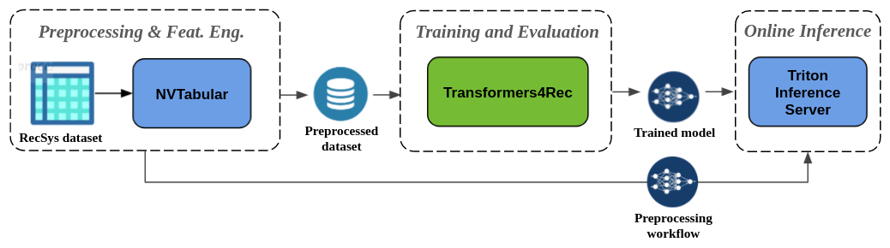

# The relationship between NLP and RecSys

Over the past decade there has been a trend toward leveraging and adapting approaches proposed by Natural Language Processing (NLP) research like Word2Vec, GRU, and Attention for recommender systems (RecSys). The phenomena is especially noticeable for sequential and session-based recommendation where the sequential processing of users interactions is analogous to the language modeling (LM) task and many key RecSys architectures have been adapted from NLP, like GRU4Rec -- the seminal Recurrent Neural Network (RNN)-based architecture for session-based recommendation.

More recently, Transformer architectures have become the dominant technique over convolutional and recurrent neural networks for language modeling tasks. Because of their efficient parallel training, these architectures scale well with training data and model size, and are effective at modeling long-range sequences. 

Transformers have similarly been applied to sequential recommendation in architectures like [SASRec](https://arxiv.org/abs/1808.09781), [BERT4Rec](https://arxiv.org/abs/1904.06690) and [BST](https://arxiv.org/pdf/1905.06874.pdf%C2%A0), providing higher accuracy than architectures based on CNN and RNNs, as can be seen in their reported experiments and also in our [ACM RecSys'21 paper](https://github.com/NVIDIA-Merlin/publications/blob/main/2021_acm_recsys_transformers4rec/recsys21_transformers4rec_paper.pdf). 

You can read more about this relationship between NLP and RecSys and the evolution of the architectures for sequential and session-based recommendation towards Transformers in our [paper](https://github.com/NVIDIA-Merlin/publications/blob/main/2021_acm_recsys_transformers4rec/recsys21_transformers4rec_paper.pdf) too.

<div style="text-align: center; margin: 20pt"><figcaption>Fig. 1 - A timeline illustrating the influence of NLP research in Recommender Systems, from the <a href="https://github.com/NVIDIA-Merlin/publications/blob/main/2021_acm_recsys_transformers4rec/recsys21_transformers4rec_paper.pdf)">Transformers4Rec paper</a></figcaption></div>


# Integration with HuggingFace Transformers

Transformers4Rec integrates with the [HuggingFace (HF) Transformers](https://github.com/huggingface/transformers) library, allowing RecSys researchers and practitioners to easily experiment with the latest and state-of-the-art NLP Transformer architectures for sequential and session-based recommendation tasks and deploy those models into production.

The HF Transformers was *"established with the goal of opening up advancements in NLP to the wider machine learning community"*. It has become very popular among NLP researchers and practitioners (more than 900 contributors), providing standardized implementations of the state-of-the-art Transformer architectures (more than 68 and counting) produced by the research community, often within days or weeks of their publication. 

HF Transformers is designed for both research and production. Models are composed of three building blocks: (a) a tokenizer, which converts raw text to sparse index encodings; (b) a transformer architecture; and (c) a head for NLP tasks, like Text Classification, Generation, Sentiment Analysis, Translation, Summarization, among others. 

In Transformers4Rec we leverage from HF Transformers only the transformer architectures building block (b) and their configuration classes. Transformers4Rec provides additional blocks necessary for recommendation, e.g., input features normalization and aggregation, and heads for recommendation and sequence classification/prediction. We also extend their `Trainer` class to allow for the evaluation with RecSys metrics.


# Flexibility in Model Architecture
Transformers4Rec provides modularized building blocks that can be combined with plain PyTorch modules and Keras layers. This provides a great flexibility in the model definition, as you can use the blocks to build custom architectures, e.g., with multiple towers, multiple heads and losses (multi-task).

In Fig. 2, we provide a reference architecture for next-item prediction with Transformers, that can be used for both sequential and session-based recommendation. We can divide that reference architecture in four conceptual layers, described next.

<div style="text-align: center; margin: 20pt"><figcaption>Fig. 2 - Transformers4Rec meta-architecture</figcaption></div>


## Features Processing 
Here the input features are processed. Categorical features are represented by embeddings. Numerical features can be represented as a scalar, projected by a fully-connected (FC) layer to multiple dimensions, or represented as a weighted average of embeddings by the technique Soft One-Hot embeddings (more info in our [paper online appendix](https://github.com/NVIDIA-Merlin/publications/blob/main/2021_acm_recsys_transformers4rec/Appendices/Appendix_A-Techniques_used_in_Transformers4Rec_Meta-Architecture.md)).

The features are optionally normalized (with layer normalization) and then aggregated. The current feature aggregation options are:
- **Concat** - Concatenation of the features
- **Element-wise sum** - Features are summed. For that, all features must have the same dimension, i.e. categorical embeddings must have the same dim and continuous features are projected to that dim.
- **Element-wise sum & item multiplication** - Similar to *Element-wise sum*, as all features are summed. except for the item id embedding, which is multiplied by the other features sum. The aggregation formula is available in our [paper](https://github.com/NVIDIA-Merlin/publications/blob/main/2021_acm_recsys_transformers4rec/recsys21_transformers4rec_paper.pdf).

**TODO: Include some snippets of `TabularSequenceFeatures`**

## Sequence Masking
Transformer architectures can be trained in different ways. Depending of the training method, there is a specific masking schema. The masking schema sets the items to be predicted (labels) and mask (hide) some positions of the sequence that cannot be used by the Transformer layers for prediction. Currently supports the following training approaches, inspired by NLP:

- **Causal LM (CLM)** - Predicts the next item based on past positions of the sequence. Future positions are masked.
- **Masked LM (MLM)** - Randomly select some positions of the sequence to be predicted, which are masked. The Transformer layer is allowed to use positions on the right (future information) during training. During inference, all past items are visible for the Transformer layer, which tries to predict the next item.
- **Permutation LM (PLM)** - Uses a permutation factorization at the level of the self-attention layer to define the accessible bidirectional context
- **Replacement Token Detection (RTD)** - Uses MLM to randomly select some items, but replaces them by random tokens. Then, a discriminator model (that can share the weights with the generator or not), is asked to classify whether the item at each position belongs or not to the original sequence. The generator-discriminator architecture was jointly trained using Masked LM and RTD tasks. 

**TODO: Include snippets of CausalLanguageModeling, MaskedLanguageModeling, PermutationLanguageModeling, ReplacementLanguageModeling**

## Sequence Processing
Processes the input sequences of interaction vectors. It can the `RNNBlock` for RNN architectures (e.g. LSTM or GRU) or the `TransformerBlock` for supported Transformer architectures.

**TODO: Describe the main options of the TransformerBlock**

**TODO: Include snippets of the RNNBlock and of TransformerBlock with causal and masked LM**

## Prediction head
The library supports the following prediction heads. They can have multiple losses, that can be combined for multi-task learning and multiple metrics.

- **Item Prediction** - Predicts items for a given sequence of interactions. During training it can be the next item or randomly selected items, depending on the masking scheme. For inference it is meant to always predict the next interacted item. Currently cross-entropy and some pairwise losses are supported. 
- **Classification** - Predicts a categorical feature using the whole sequence. In the context of recommendation, it can be used to predict for example if the user is going to abandon a product added to cart or proceed to its purchase.
- **Regression** - Predicts a continuous feature using the whole sequence. The label could be for example the elapsed time until the user returns to a service.

**TODO: Include snippets of the different heads**

### Tying embeddings
For the Item Prediction head, it is available an option called **Tying Embeddings**, proposed originally by the NLP community to tie the weights of the input (item id) embedding matrix with the output projection layer. **Tying Embeddings** showed to be a very effective technique in extensive experimentation for competitions and empirical analysis (more details in our [paper](https://github.com/NVIDIA-Merlin/publications/blob/main/2021_acm_recsys_transformers4rec/recsys21_transformers4rec_paper.pdf) and its [online appendix](https://github.com/NVIDIA-Merlin/publications/blob/main/2021_acm_recsys_transformers4rec/Appendices/Appendix_A-Techniques_used_in_Transformers4Rec_Meta-Architecture.md)). You can enable this option as follows.

**TODO: Include example with tying embeddings**

### Regularization

The library supports a number of regularization techniques like Dropout, Weight Decay, Softmax Temperature Scaling, Stochastic Shared Embeddings, and Label Smoothing. In our extensive experimentation hypertuning all regularization techniques for different dataset we found that the Label Smoothing was particularly useful at improving both train and validation accuracy and better calibrating the predictions. 

**TODO: Include example with Label Smoothing**

More details of the options available for each building block can be found in our **API Documentation**.

# Training and evaluation

## Data loading
Transformers4Rec leverages by default the NVTabular dataloader for GPU-accelerated loading of preprocessed data stored in Parquet format, which is a suitable format for being structured and queryable. 
The data in Parquet files are directly loaded to GPU memory as feature tensors. CPUs are also supported when GPUs are not available.

**TODO: Include code snippets to instantiate NVT dataloader for PyTorch**

**TODO: Include code snippets to instantiate NVT dataloader for TF**


**TODO: Describe the data loading options for TF**


## PyTorch Training
For PyTorch we extend the HF Transformers `Trainer` class, but keep its `train()` method. That means that we leverage the efficient training implementation from that library, which manages for example half-precision (FP16) and multi-GPU training.

Two [approaches](https://pytorch.org/tutorials/intermediate/ddp_tutorial.html) are available for PyTorch multi-GPU training: `DataParallel` and `DistributedDataParallel`. `DataParallel` uses a single process and multiple threads on a single machine. `DistributedDataParallel` is more efficient for assigning separate processes for each GPU. Transformers4Rec supports both training approaches when using the NVTabular Dataloader.

**TODO: Update the previous statement if we cannot have `DistributedDataParallel` working completely with our Data loader.**

**TODO: Include code snippets for training with PyTorch**

##  Tensorflow Training

**TODO: Describe the training options for TF**

**TODO: Include code snippets for training with PyTorch**

## Evaluation
For the Item Prediction head, the following top-N metrics are supported:

Top-N metrics
- Precision@n
- Recall@n

Ranking metrics
- NDCG@n
- MAP@n
- MRR@n


During training, the metrics are computed each N steps for both training and evaluation sets. During evaluation, the metrics are computed for all evaluation batches and averaged.

### Incremental Evaluation
You can implement incremental evaluation by splitting your data into time windows (e.g. week, day or hour). Then you can have a loop that trains (or fine-tune a pre-trained model) with session of time window T and evaluates on sessions of time window T+1.

**TODO: Include a snippet with a for loop for incremental evaluation**


# End-to-end pipeline with Merlin

Transformers4Rec has a first-class integration with NVIDIA Merlin components, to build end-to-end GPU accelerated pipelines for sequential and session-based recommendation.

<div style="text-align: center; margin: 20pt"><figcaption>Fig.3 Pipeline for Sequential and Session-based recommendation using NVIDIA Merlin components</figcaption></div>

## Integration with NVTabular

[NVTabular](https://github.com/NVIDIA/NVTabular/) is a feature engineering and preprocessing library for tabular data that is designed to easily manipulate terabyte scale datasets and train deep learning (DL) based recommender systems. 

It has some popular [techniques](https://nvidia.github.io/NVTabular/main/api/index.html) to deal with categorical and numerical features like `Categorify`, `Normalize`, `Bucketize`, `TargetEncoding`, `DifferenceLag`, to name a few supported, and also allow for the definition of custom transformations (`LambdaOp`) using cuDF data frame operations.

Usually the input RecSys datasets contains one example per user interaction. For sequential recommendation, the training example is a sequence of user interactions, and for session-based recommendation it is a sequence of session interactions. In practice, each interaction-level feature needs to be converted to a sequence grouped by user/session and their sequence length must match, as each position of the sequence correspond to one interaction. You can see in Fig. 4 how the preprocessed parquet should look like.

<div style="text-align: center; margin: 20pt"><figcaption>Fig.3 Pipeline for Sequential and Session-based recommendation using NVIDIA Merlin components</figcaption></div>

NVTabular can easily prepare such data with the [Groupby](https://nvidia.github.io/NVTabular/main/api/ops/groupby.html) op, which allows grouping by a categorical column (e.g. user id, session id), sorting by another column (e.g. timestamp) and aggregating other columns as sequences (`list`) or by taking the `first` or `last` element of the sequence, as exemplified below. 

```python
groupby_features = [
    'user_id', 'session_id', 'product_id', 'category_id', 'timestamp'
] >> ops.Groupby(
    groupby_cols=['session_id'],
    sort_cols=['timestamp'],
    aggs={
        'product_id': 'list',
        'category_id': 'list',
        'timestamp': ['first', 'last'],
    },
)
```

### Outputs

NVTabular outputs parquet files with the preprocessed data. The parquet files can be (Hive) partitioned by a categorical column (e.g. day, company).

**TODO: Include code snippet on how to save the output parquet files partitioned by a column**

NVTabular also outputs a schema of the parquet columns in Profobuf Text format, e.g. including the cardinality of categorical features, the max squence length for sequential features and tags that can be associated to features (e.g. to indicate what is the item id, what are item and user features, what are categorical or continuous features). You can see [here](../../tests/assets/yoochoose/schema.pbtxt) an example of such schema in Protobuf Text format.
P.s. If you don't use NVTabular to preprocess your data, you can generate the Schema via code.  

**TODO: Include code snippet of how to define the Schema manualy using code**

The NVTabular workflow can be saved after `workflow.fit()` is called, so that the same preproc workflow can be applied to new input data, either in batch or online (via integration with Triton Inference Server), described in the next section.

**TODO: Include code snippet on how to save the NVTabular workflow**


## Integration with Triton Inference Server

**TODO: Describe the integration with Triton**