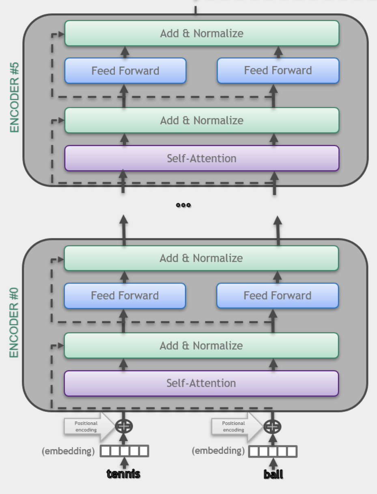
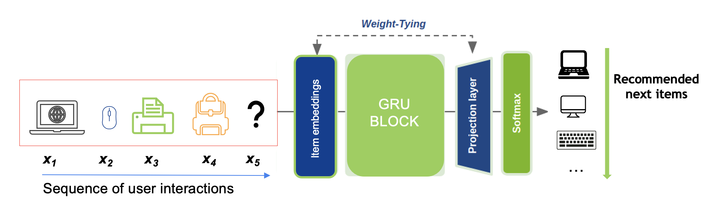
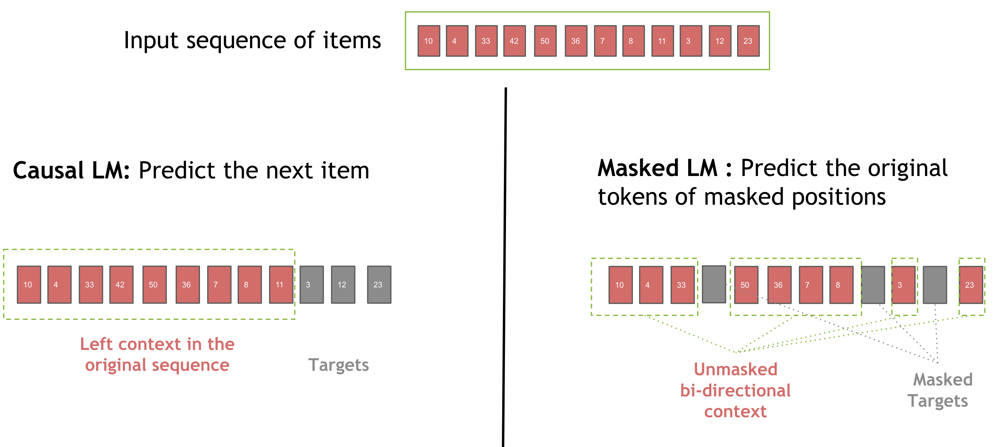
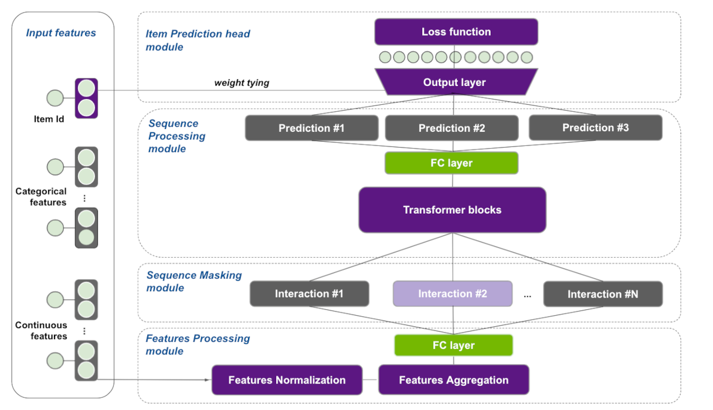
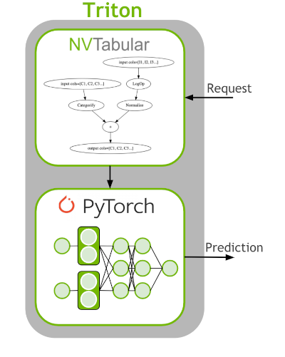
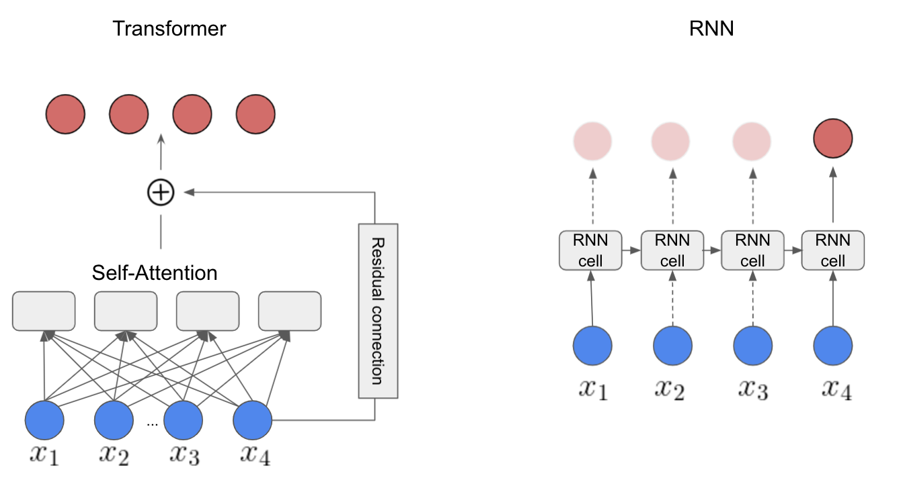

This page is just to make Sphinx include the images in the `"docs/build/html/_images"` folder, so that they can be referred using the `` HTML tag

Figures from "Getting Started"

Figures from "Core features"

Figures from tutorial notebooks

